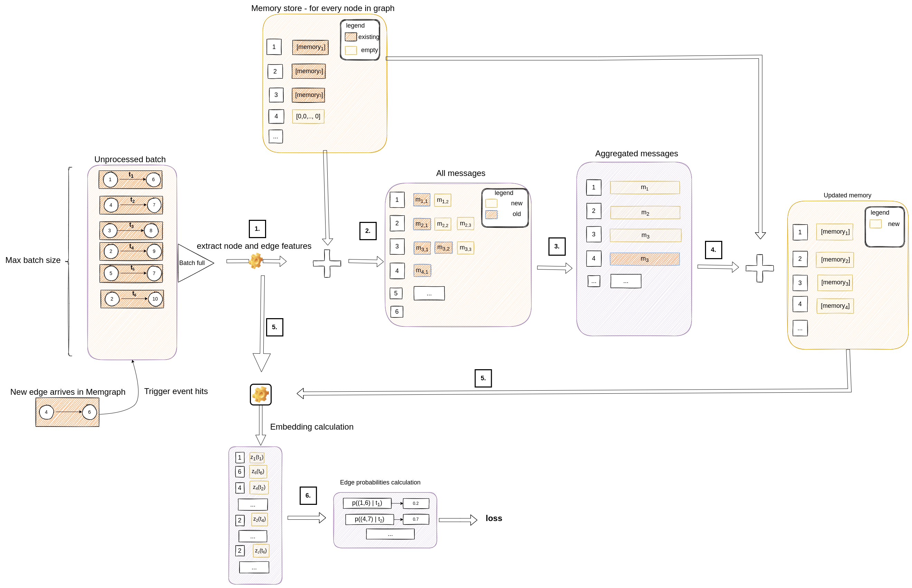
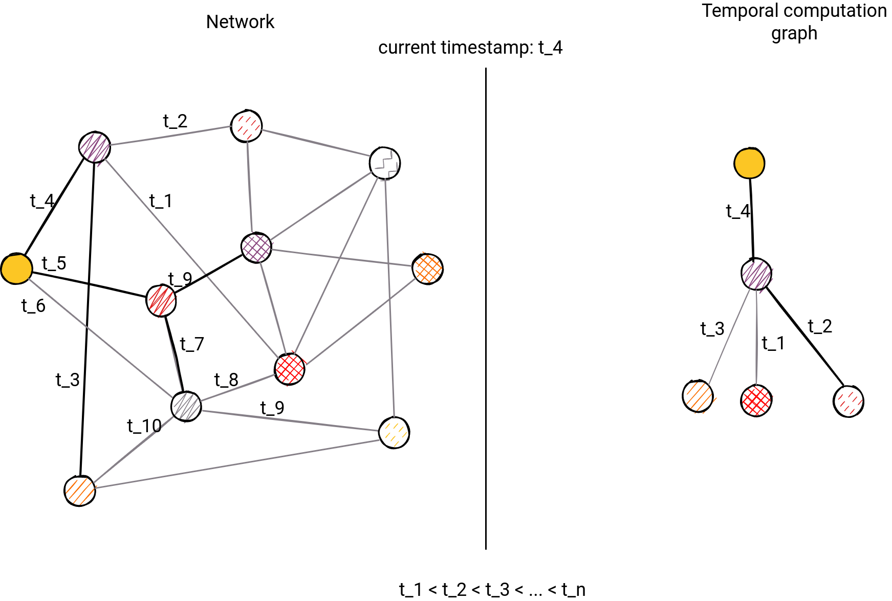
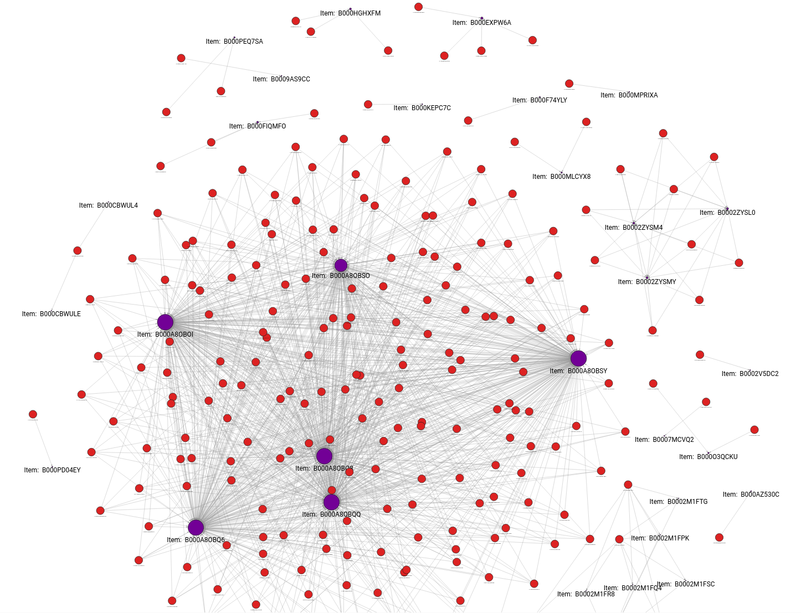
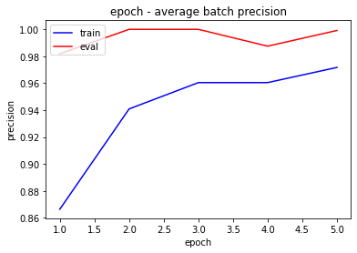

#PyTorch x Amazon product reviews = :heart:

The purpose of this **Jupyter Notebook** is to make it easy to start **exploring and learning**
about **Temporal Graph Networks** and **GNNs** as part of **Memgraph** and in general.


## Table of contents
 * [Introduction to repo](#introduction)
 * [What are Graph Neural Networks and TGN](#what-are-gnns)
 * [Dataset visualized](#dataset-visualized)
 * [About Amazon product dataset](#about-dataset)
 * [Setup](#setup)
 * [Learning materials](#learning-materials)

##Introduction
This directory is an example of how to use **[Temporal Graph Networks](https://memgraph.com/docs/mage/query-modules/python/tgn)** for the
link prediction on **[Amazon product graph](http://snap.stanford.edu/data/amazon/productGraph/)** dataset.

In this Jupyter Notebook  we run **[Memgraph](https://memgraph.com/docs/memgraph/)** inside 
**[Docker](https://www.docker.com/)** and use **[GQLAlchemy](https://memgraph.com/docs/gqlalchemy/)** as a link between 
graph database objects and Python objects. To start, you will need **Docker** and to download 
**Docker image** of **[Memgraph Platform](https://memgraph.com/download)**


## What are GNNs
**Graph neural networks** present a neural network model that works with convolutions on graphs. It all started
with **[Graph convolutional networks](https://arxiv.org/abs/1609.02907)** and scientists' idea to start exploring signals on graphs.
Those ideas first yielded [spectral clustering](https://arxiv.org/pdf/0711.0189.pdf), 
but after several years of researching signals in graphs **graph neural networks** were born.
Afterwards, **GNNs** expanded and started adapting **inductive** learning methods, which helped with their development on dynamic graphs - 
**[Temporal Graph Networks (TGN)](https://towardsdatascience.com/temporal-graph-networks-ab8f327f2efe)**.

Here is a schematic view of how **TGN** works:


As you can see, the process uses batch processing. In this image, we presented how the edge prediction task works
with **interaction events** as the main building block of **TGN**. Interaction event is an another name for the creation of an edge
between two nodes. After a batch is full, we extract features from nodes and edges. From those features and old memory, we 
create **messages** for each of **interaction events**. Note that each interaction event generates **two** messages, one
for the *source node* and the other for the *destination node* of the edge. In step 3, messages fare aggregated for each node. In a batch 
of messages, there are some old messages from nodes that already had interaction events in a graph. In our example, we use
a message aggregator called **last** in research paper. It works by only taking the **last** message to represent the  message aggregation.
The other options are **mean** or **LSTM**. Now, the memory needs to be updated from new aggregated messages and the old memory.
The final step includes the calculation of embeddings from the updated memory and *node and edge* features which represent the initial node embedding. This part of the embedding calculation is not simple - for every node, a new 
**computation graph** needs to be made because it depends on when the said node last had an interaction since it doesn't have access to nodes from the future. To check how we implemented it, jump to [our GitHub site](https://github.com/memgraph/mage).



You can learn more about how **TGN** works from [learning materials](#learning-materials) down below.

## Dataset visualized
We will start exploring **TGN** with our **Amazon product** dataset looks. We have used **Memgraph Lab** to create
this visualization. Memgraph Lab comes in **Memgraph Platform** and allows you to create custom styles ([docs](https://memgraph.com/docs/memgraph-lab/)**).




## About dataset
All the information about the dataset can be found at the following **[link](http://snap.stanford.edu/data/amazon/productGraph/)**.

From the dataset description: 
```plaintext
This dataset contains product reviews and metadata from Amazon, 
including 143.7 million reviews spanning May 1996 - July 2014.

This dataset includes reviews (ratings, text, helpfulness votes), 
product metadata (descriptions, category information, price, brand, and image features), 
and links (also viewed/also bought graphs).
```

## Setup
1. Firstly, go to **[Stanford page](http://snap.stanford.edu/data/amazon/)** which contains dataset of Amazon product reviews.
2. Pick one of the datasets, download it, and extract it to the `pytorch_amazon_network_analysis/data/product_reviews.txt` path
3. Use the script we prepared in `./public/json_converter.py` to create a JSON file from your dataset. 
4. Now use`./public/main.py` to create cypher queries. Now we can start exploring **TGN** as part of **Jupyter Notebook**.
5. Open **Jupyter Lab** and run the cells. **Memgraph** should be up and running in order for all cells to be successfully run.

## Results visualized
In our experiments we used a dataset of around 11500 edges. For that kind of a dataset we don't need that many epochs to achieve pretty good results.


## Learning materials
If you wish to start exploring about **TGN**, you can read one of the following:
* go to our [page](https://memgraph.com/docs/mage/query-modules/python/tgn) 
* read a paper about **[TGN](https://arxiv.org/pdf/2006.10637.pdf)**
* watch a video explanation about **[TGN](https://www.youtube.com/watch?v=0tw66aTfWaI&t=1s)**
